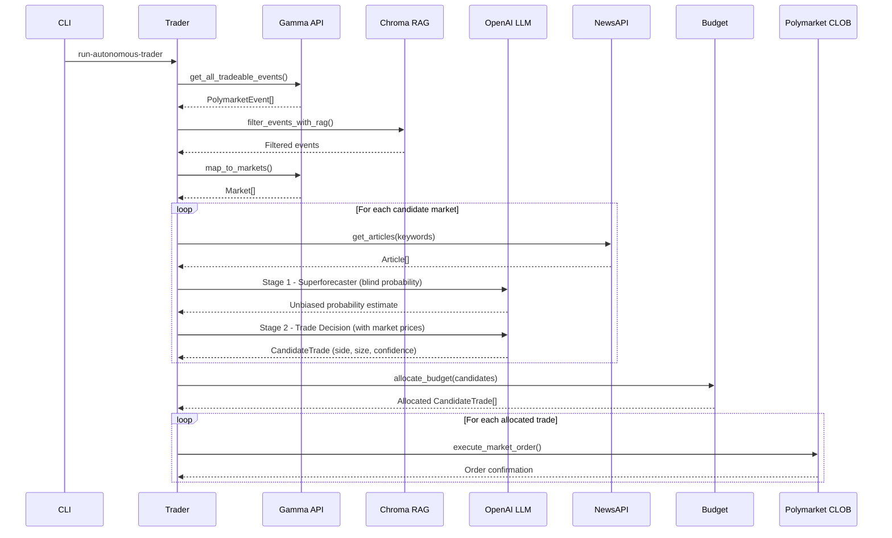
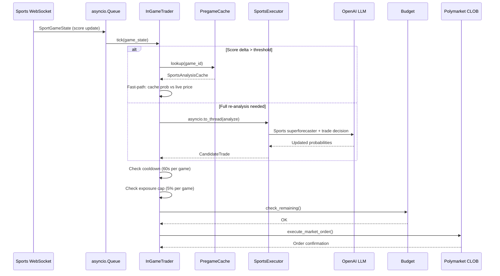
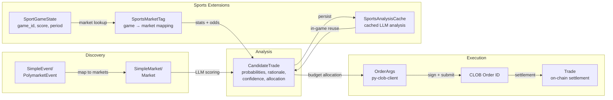
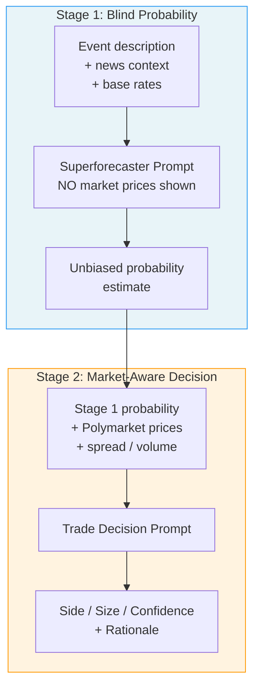
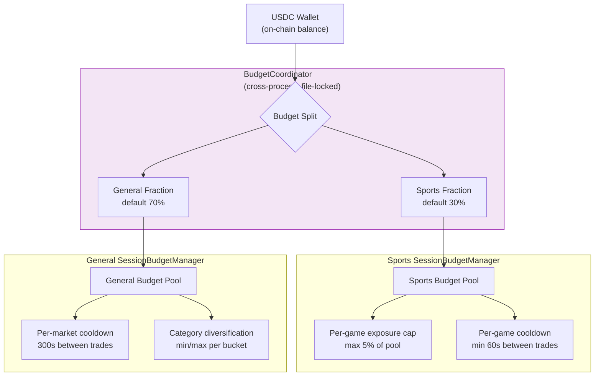
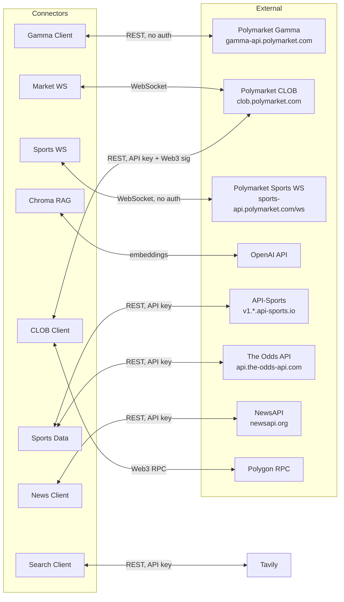
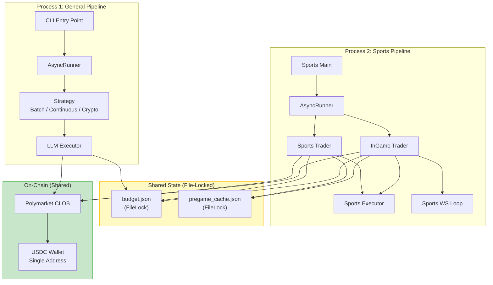
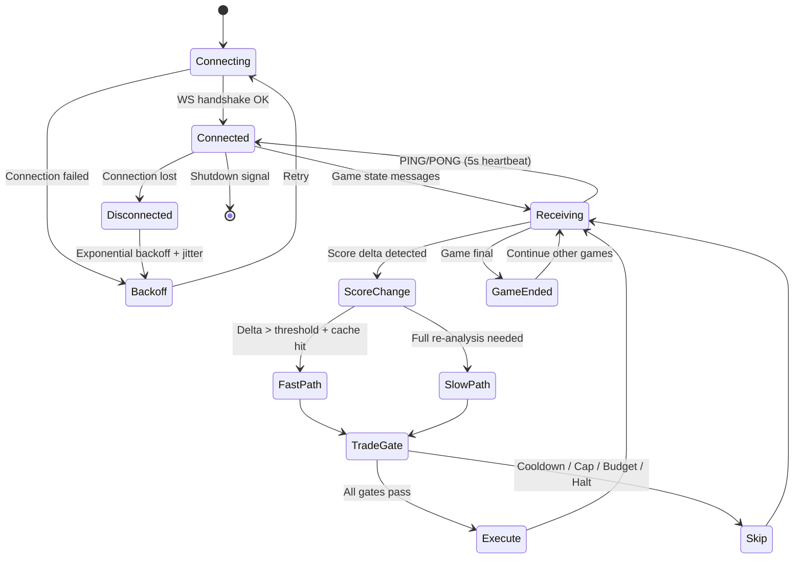

# Polyagents Architecture

## System Overview

```mermaid
graph TB
    subgraph Entry["Entry Points"]
        CLI["CLI<br/>scripts/python/cli.py"]
        SPORTS_MAIN["Sports Main<br/>agents/sports.py"]
        DOCKER["Docker Container"]
    end

    subgraph Pipelines["Trading Pipelines"]
        BATCH["Batch Trader<br/>trade.py"]
        CONTINUOUS["Continuous Strategy<br/>continuous.py"]
        CRYPTO["Crypto Strategy<br/>crypto.py"]
        ARB["BTC Arbitrage<br/>btc_arbitrage.py"]
        SPORTS_PRE["Sports Pre-Game<br/>sports_trader.py"]
        INGAME["In-Game Trader<br/>ingame_trader.py"]
    end

    subgraph Core["Core Engine"]
        EXECUTOR["LLM Executor<br/>executor.py"]
        SPORTS_EXEC["Sports Executor<br/>sports_executor.py"]
        BUDGET["Budget Manager<br/>budget.py"]
        RUNNER["Async Runner<br/>runner.py"]
        PROMPTS["Prompt Templates<br/>prompts.py"]
    end

    subgraph Connectors["Connectors"]
        GAMMA["Gamma API Client<br/>gamma.py"]
        POLY_CLOB["Polymarket CLOB<br/>polymarket.py"]
        CHROMA["Chroma RAG<br/>chroma.py"]
        NEWS["News Connector<br/>news.py"]
        SEARCH["Web Search<br/>search.py"]
        SPORTS_WS["Sports WebSocket<br/>sports_ws.py"]
        SPORTS_DATA["Sports Data<br/>sports_data.py"]
        WS["Price WebSocket<br/>websocket.py"]
    end

    subgraph External["External Services"]
        PM_GAMMA["Polymarket Gamma API"]
        PM_CLOB["Polymarket CLOB API"]
        PM_WS["Polymarket Sports WS"]
        OPENAI["OpenAI API"]
        API_SPORTS["API-Sports"]
        ODDS_API["The Odds API"]
        NEWS_API["NewsAPI"]
        POLYGON["Polygon RPC"]
    end

    subgraph Storage["Data Stores"]
        CHROMA_DB["ChromaDB<br/>(Vector Store)"]
        PREGAME_CACHE["Pregame Cache<br/>(JSON + FileLock)"]
        BUDGET_FILE["Budget State<br/>(JSON + FileLock)"]
        WALLET["USDC Wallet<br/>(On-Chain)"]
    end

    CLI --> BATCH & CONTINUOUS & CRYPTO & ARB
    SPORTS_MAIN --> SPORTS_PRE & INGAME
    DOCKER --> CLI & SPORTS_MAIN

    BATCH --> EXECUTOR & BUDGET
    CONTINUOUS --> EXECUTOR & RUNNER & BUDGET
    CRYPTO --> EXECUTOR & RUNNER & WS
    ARB --> WS
    SPORTS_PRE --> SPORTS_EXEC & BUDGET
    INGAME --> SPORTS_EXEC & SPORTS_WS & BUDGET

    EXECUTOR --> GAMMA & CHROMA & NEWS & SEARCH & PROMPTS
    SPORTS_EXEC --> SPORTS_DATA & PROMPTS
    BUDGET --> BUDGET_FILE

    GAMMA --> PM_GAMMA
    POLY_CLOB --> PM_CLOB & POLYGON
    CHROMA --> CHROMA_DB & OPENAI
    NEWS --> NEWS_API
    SPORTS_WS --> PM_WS
    SPORTS_DATA --> API_SPORTS & ODDS_API
    WS --> PM_CLOB

    EXECUTOR --> OPENAI
    SPORTS_EXEC --> OPENAI
    SPORTS_PRE --> PREGAME_CACHE
    INGAME --> PREGAME_CACHE

    BATCH --> POLY_CLOB
    CONTINUOUS --> POLY_CLOB
    CRYPTO --> POLY_CLOB
    ARB --> POLY_CLOB
    SPORTS_PRE --> POLY_CLOB
    INGAME --> POLY_CLOB
    POLY_CLOB --> WALLET
```

## Data Flow: Batch Trading Pipeline

## Data Flow: Sports In-Game Pipeline

## Data Model Transformations

## Two-Stage LLM Analysis Pattern

## Budget Architecture

## Connector Layer & External Services

## Process Architecture

## Sports WebSocket Lifecycle

