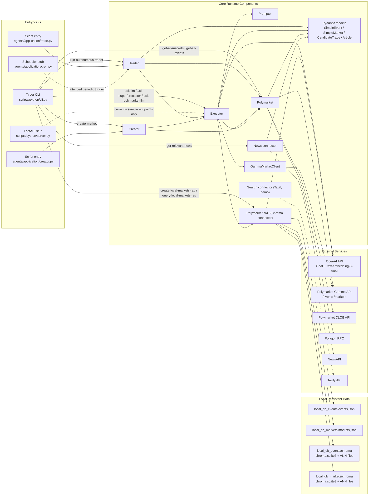
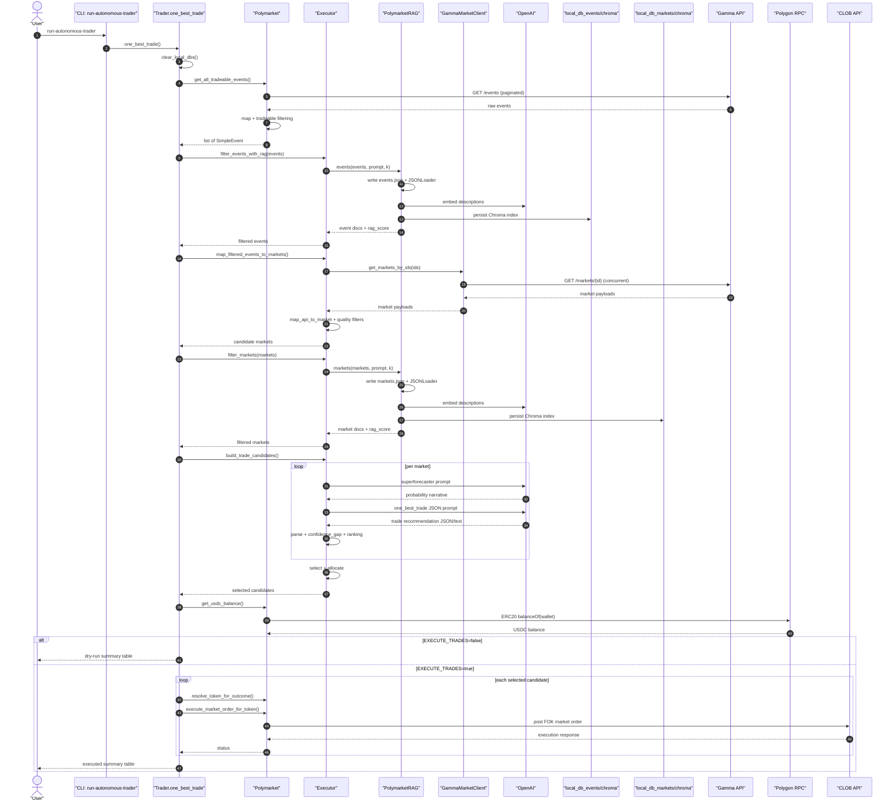
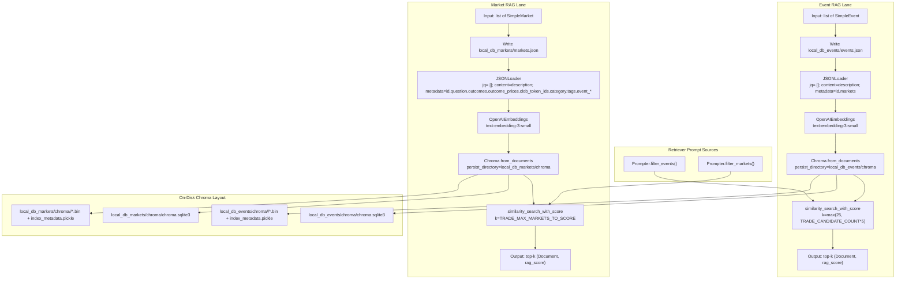
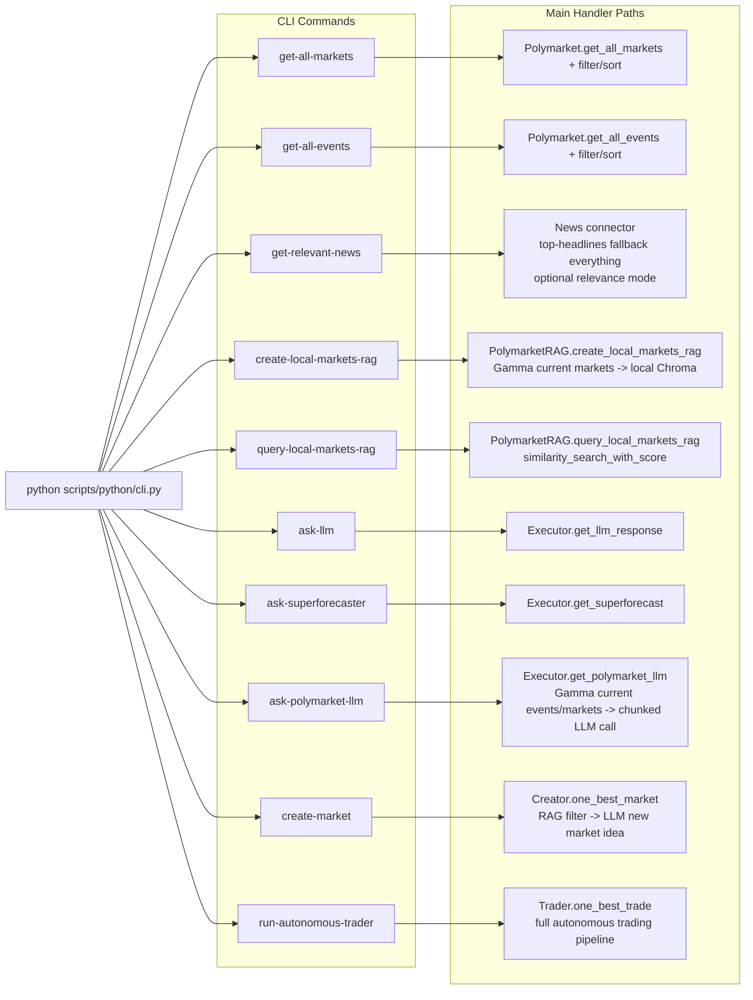

# Current System Architecture

This document captures the current architecture implemented in this repository, including the RAG pipeline and all major runtime paths.

## 1) Full System Architecture

## 2) End-to-End Autonomous Trading Sequence

## 3) RAG Internals + Storage and DB

## 4) CLI and Non-Autonomous Flows

## Notes

- RAG database backend in this repo is local Chroma persistence (SQLite metadata + ANN index files), not Postgres/pgvector.
- `scripts/python/server.py` and `agents/application/cron.py` are currently stubs and are not wired into production trading flow by default.
